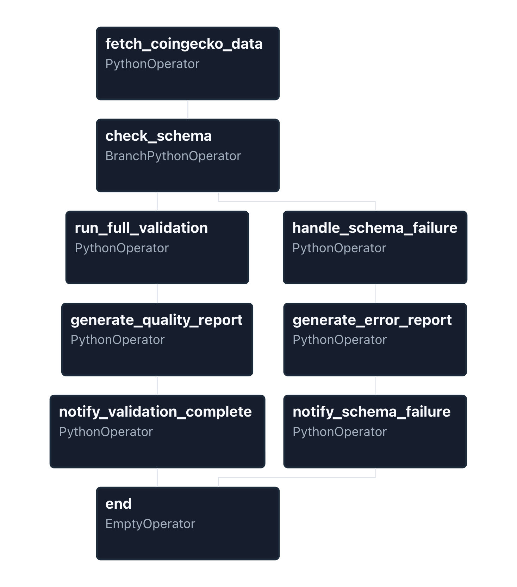
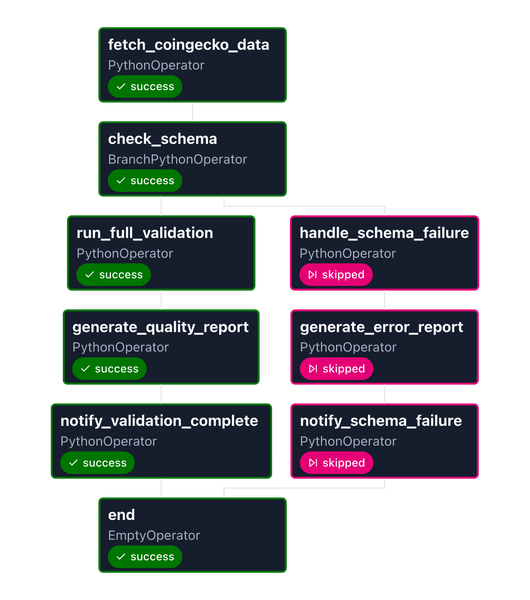
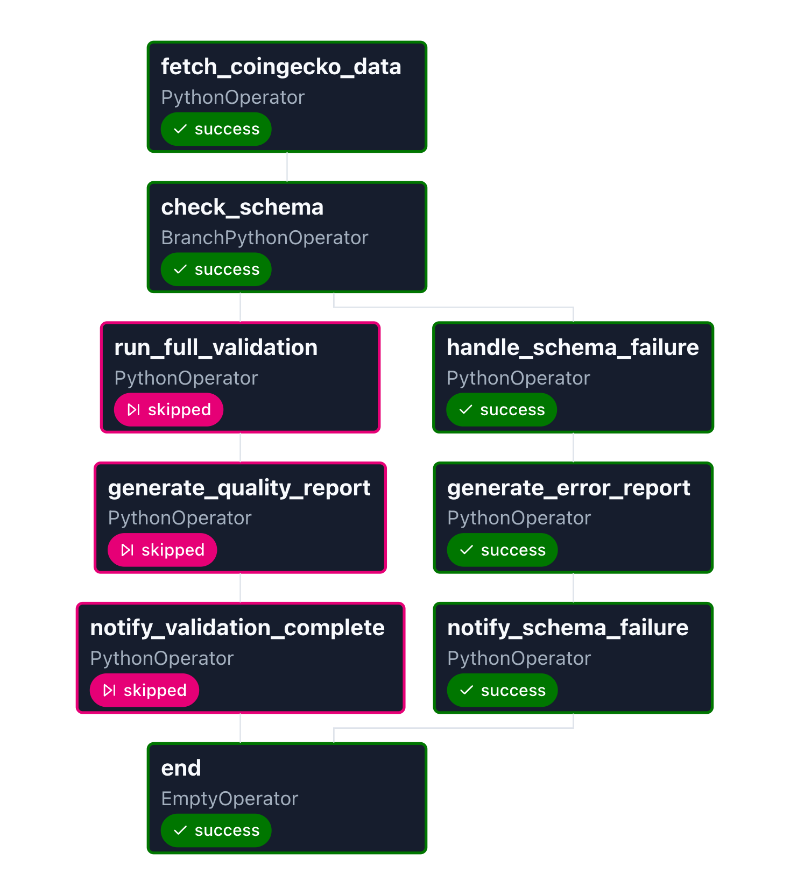

# Crypto Market Data Validation Pipeline

An Apache Airflow pipeline that fetches cryptocurrency market data from the CoinGecko API, validates schema and data quality, and produces flagged datasets and validation reports.

## Overview

- **Fetch**: Pull market data from [CoinGecko](https://www.coingecko.com/) `/coins/markets` endpoint.
- **Schema validation**: Ensure required columns and structure before running full validation.
- **Data validation**: Flags data quality issues (invalid numeric types, abnormal prices, invalid market cap, missing values, duplicates) without modifying source data—adds flag columns to preserve data integrity.
- **Reports**: JSON quality reports and schema error reports; CSV outputs for raw and flagged data.

## Project Structure

```
airflow_crypto_project/
├── dags/
│   └── crypto_market_data_pipeline.py   # Airflow DAG: fetch → schema check → full validation or schema failure
├── src/
│   ├── __init__.py
│   ├── schemas.py                  # Pydantic model for CoinGecko API response (CryptoDataSchema)
│   ├── constants.py                # Schema/validation status enums and flag column names
│   ├── api_client.py               # CoinGecko API client (CoinGeckoClient, CoinGeckoAPIError)
│   ├── validators.py               # CryptoDataValidator: schema + flag validations + reports
│   └── report_types.py             # TypedDicts for validation and schema error reports
├── tests/
│   ├── __init__.py
│   ├── test_api_client.py          # Unit tests for CoinGeckoClient
│   └── test_validators.py          # Unit tests for CryptoDataValidator
├── data/
│   ├── raw/                        # Raw CSV from CoinGecko (e.g. crypto_raw_YYYYMMDD.csv)
│   ├── flagged/                    # Flagged CSV with validation columns (e.g. flagged_YYYYMMDD.csv)
│   └── reports/                    # Quality reports and schema error reports (JSON)
├── config/                         # Airflow and environment config (e.g. airflow.cfg, postgres, sql)
├── logs/                           # Airflow task logs
├── plugins/                        # Custom Airflow plugins (optional)
├── images/
├── docker-compose.yaml
├── requirements.txt
├── .env.example
├── .gitignore
└── README.md  
```

## Prerequisites

- Docker and Docker Compose
- Python 3.10+ (for local tests)
- Dependencies: `pandas`, `pydantic`, `requests`, `typing_extensions`

For containerized runs, the DAG assumes data under `/opt/airflow/data`; adjust `DATA_BASE_PATH` in the DAG if needed.

## Setup and Running

1. **Clone and enter the project**
   ```bash
   git clone https://github.com/maskaiyen/airflow_crypto_project.git
   cd airflow_crypto_project
   ```

2. **Create .env from template**
   ```bash
   cp .env.example .env
   ```

3. **Generate secure keys**
   ```bash
   python -c "from cryptography.fernet import Fernet; print(Fernet.generate_key().decode())"
   # Copy output to AIRFLOW__CORE__FERNET_KEY in .env 

   openssl rand -hex 32
   # Copy output to AIRFLOW__WEBSERVER__SECRET_KEY in .env
   ```

4. **Set your user ID**
   ```bash
   # Linux/macOS: run `id -u` and update AIRFLOW_UID in .env
   # Windows: use 50000
   ```

5. **Edit .env and fill in the values**
   ```bash
   nano .env
   ```

6. **Initialize and start**
   ```bash
   docker compose up airflow-init
   docker compose up -d
   ```

7. **Access Airflow UI**
   - URL: http://localhost:8080
   - Username: `airflow`
   - Password: `airflow`

8. **Trigger the DAG**
   - Navigate to `crypto_market_data_pipeline`
   - Click Trigger button to run manually

9. **Run Tests (local)**
   ```bash
   pytest tests/ -v
   ```

## Pipeline Architecture

### DAG Structure

  
*Airflow Graph View showing the pipeline with branching logic*

## DAG: `crypto_market_data_pipeline`

| Step | Task | Description |
|------|------|-------------|
| 1 | `fetch_coingecko_data` | Call CoinGecko API, save CSV to `data/raw/crypto_raw_{ds_nodash}.csv`, push paths via XCom |
| 2 | `check_schema` | Validate DataFrame schema (required fields, non-empty). **Branch**: valid → `run_full_validation`, invalid → `handle_schema_failure` |
| 3a | `run_full_validation` | Run all flag validations, write flagged CSV to `data/flagged/` |
| 3b | `handle_schema_failure` | Write schema error report to `data/reports/schema_error_report_{ds_nodash}.json` |
| 4 | `generate_quality_report` / `generate_schema_error_report` | Write quality report and schema error report to `data/reports/` |
| 5 | `notify_validation_complete` / `notify_schema_failure` | Log summary (stubs for Slack/email) |
| 6 | `end` | Join branch and finish |

## Source Modules

### `src/schemas.py`

- **`CryptoDataSchema`**: Pydantic model for CoinGecko `/coins/markets` response (id, symbol, name, prices, market_cap, volume, supply, etc.). Used to parse and validate API responses.

### `src/constants.py`

- **`SchemaValidationStatus`**: `VALID`, `EMPTY_DATA`, `INVALID_TYPE`, `MISSING_REQUIRED_FIELDS`
- **`ValidationStatus`**: `PASSED`, `FAILED`, `SKIPPED`
- **`ValidationFields`**: Column names for flags (`has_non_numeric_value`, `has_abnormal_price`, `has_invalid_market_cap`, `has_missing_values`, `has_duplicate`, `validated_at`)

### `src/api_client.py`

- **`CoinGeckoClient`**: HTTP client for CoinGecko API; `get_markets_data()` returns a list of `CryptoDataSchema`. Handles timeouts, non-200 responses, and 429 rate limits.
- **`CoinGeckoAPIError`**: Raised on API or network errors.

### `src/validators.py`

- **`CryptoDataValidator`**:
  - **Schema**: `validate_schema(df)` → `SchemaValidationStatus`
  - **Flags**: `flag_invalid_numeric_types`, `flag_abnormal_prices`, `flag_invalid_market_cap`, `flag_missing_values`, `flag_duplicates`, `add_metadata`
  - **Reports**: `generate_validation_report(df)`, `generate_schema_error_report(status)`

### `src/report_types.py`

- TypedDicts for structured reports: `ValidationItemReport`, `ValidationSummary`, `ValidationReport`, `SchemaErrorSummary`, `SchemaErrorReport`.

## Data Directories

| Directory | Purpose |
|-----------|--------|
| **data/raw/** | Raw market data CSVs from CoinGecko (one file per run, dated). |
| **data/flagged/** | Same data with validation flag columns and metadata; written only when schema is valid and full validation runs. |
| **data/reports/** | `quality_report_{date}.json` (full validation) and `schema_error_report_{date}.json` (schema failure). |

## Config, Logs, Plugins

- **config/** – Airflow and DB/config files (e.g. `airflow.cfg`, `postgres.py`, `sql.py`). Use for environment-specific settings.
- **logs/** – Airflow scheduler and task logs (created at runtime).
- **plugins/** – Optional custom operators, hooks, or plugins; empty by default.

## Tests

- **tests/test_api_client.py**: Parameter validation, successful response parsing, 429/4xx/5xx handling, timeouts, and request errors for `CoinGeckoClient`.
- **tests/test_validators.py**: Schema validation (valid/empty/missing fields), all flag methods, report generation, and edge cases for `CryptoDataValidator`.

Run the full test suite:

```bash
pytest tests/ -v
```

## Monitoring

#### Successful pipeline execution

  
*All tasks completed successfully with full validation and quality report*

#### Failure handling (schema branch)

  
*Schema validation failure triggering the schema failure branch*

## Skills & Technologies Demonstrated

| Area | What this project shows |
|------|-------------------------|
| **Apache Airflow** | DAG definition, `PythonOperator`, `BranchPythonOperator`, XCom, trigger rules, retries and backoff |
| **Data pipelines** | Fetch → validate (schema) → branch → full validation or failure handling → reports and notifications |
| **Data quality** | Schema checks, numeric/range validation, business rules (e.g. market_cap ≈ price × supply), missing values and duplicates |
| **API integration** | HTTP client, Pydantic response models, error handling (timeouts, 429, 4xx/5xx) |
| **Python** | Type hints, enums, TypedDicts, pandas, structured logging |
| **Testing** | Unit tests with pytest and mocks for API client and validators |
| **DevOps / runtime** | Docker Compose for Airflow, config and data directory layout |

## License

MIT License.
